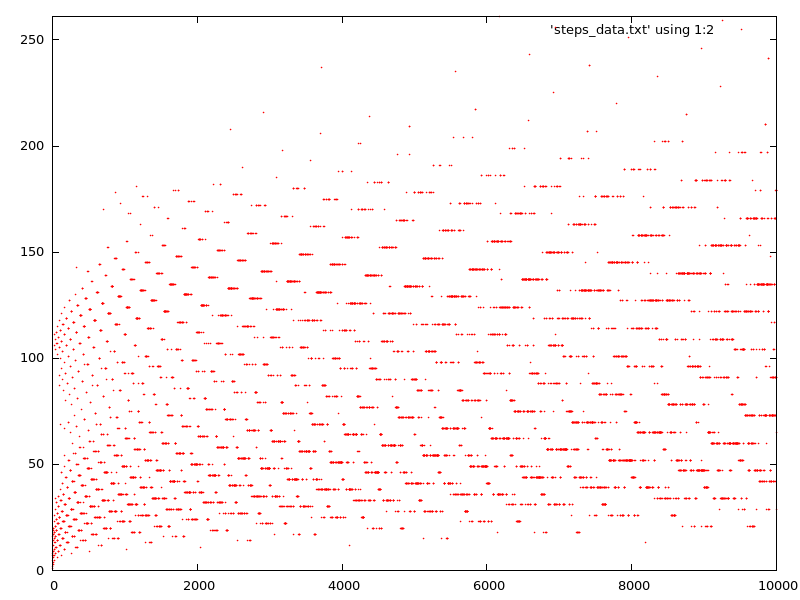
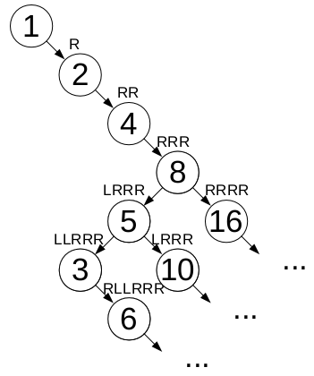
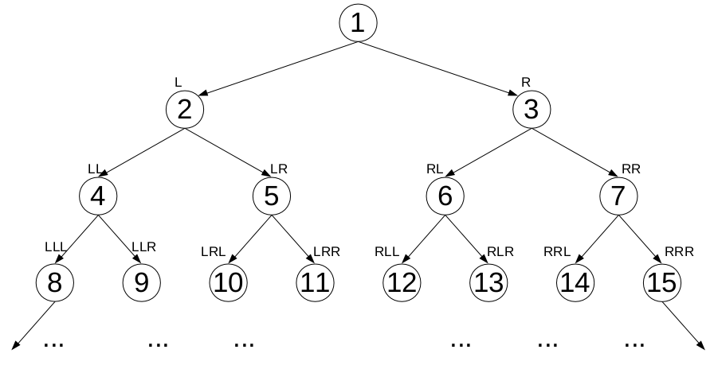

# Collatz Conjecture

This is a famous problem in mathematics. One of the reasons it is so famous is that, although the statement of the problem is very simple, there is currently no solution to this problem.

## Statement of the problem

The problem can be stated as follows:

Take a positive integer n, and apply the following transformation repeatedly:

n -> (3*n +1) , if n is odd

n -> n/2      , if n is even

Let's see some examples for different values of n:

n = 1: 1 -> 4 -> 2 -> 1 -> 4 -> 2 ... (Cycles forever)

n = 3: 3 -> 10 -> 5 -> 16 -> 8 -> 4 -> 2 -> 1

n = 6: 6 -> 3 -> 10 -> 5 ... (subsequence of n=5)

n = 7: 7 -> 22 -> 11 -> 34 -> 17 -> 52 -> 26 -> 13 -> 40 -> 20 -> 10 -> 5 ... (subsequence of n=5)


For the four examples shown above, we can see that all sequences end in the number 1 and the cycle (4 -> 2 -> 1) repeats forever.
The Collatz conjecture states that the sequence of transformations for any positive integer will reach 1. This also has the implication that, except for (4 -> 2 -> 1 -> 4 ...), there are no other cycles or loops.

## Finding the sequence for any number with Python

Writing a program to generate the collatz numbers of a given integer n is an easy exercise. The program [Collatz_1.py](https://github.com/LuisGerman92/Collatz/blob/master/collatz_1.py) takes an integer from the command line, prints all the integers generated by applying the transformation until it reaches one, and also reports the number of integers that are required to reach one.

Running the program with the number 7 as input produces the following output:


```console
luis@Lap:~/Collatz$ ./collatz_1.py 7
Displaying the Collatz numbers for n= 7
22
11
34
17
52
26
13
40
20
10
5
16
8
4
2
1
7 has  16  integers.
```

## Approaches to finding a solution

The question that we want to answer is: 

**Do all integer numbers eventually reach 1?**

When we want to find the solution to a problem, usually the process is to view the problem from different angles, searching for a pattern, or some sort of structure in the data. Maybe we can find a pattern if we write the numbers in binary form, or maybe we could come with a formula for the number of steps required for a number n to reach 1.

### Plotting the steps required to reach 1

We can take the code from [Collatz_1.py](https://github.com/LuisGerman92/Collatz/blob/master/collatz_1.py) and write a function that takes a number n and returns the number of steps required to reach 1:

```python
# Takes an integer n and returns the number of steps(transformations) required to reach 1
def stepsTo1(n):
    steps = 0
    while(not (n == 1)):
        # even number
        if (n % 2 == 0):
            n = n/2
        else: # odd number
            n = 3*n+1
            
        steps += 1
    return steps
```
Then, we simply make a script that calls this function for different values of n, and writes them to a file.
The script plotSteps.py takes an integer from the command line and outputs the results to the file "steps_data.txt".
Then this data can be plotted with the following gnuplot script:
```
#!/usr/bin/gnuplot

reset

# png
set terminal pngcairo size 800,600 enhanced font 'Verdana,10'
set output 'Collatz_steps.png'

# color definitions
#set border linewidth 1.5
set style line 1 lc rgb '#0060ad' pt 5 ps 0.5 lt 1 lw 1 # --- blue

set xrange [0:10000]
set yrange [0:261]

plot 'steps_data.txt' using 1:2 pt 7 ps 0.1
```

We can now plot the steps required to reach 1 for the first 10,000 integers:




### Binary representation of the sequence

Since any sequence only contains integer numbers, and the transformations only involve addition, multiplication, and division, it might be an interesting idea to see if we can find a pattern in the binary representation of the numbers and their transformations.

First, we write a function to print the binary representation of an integer number:

```python
def dispBinary(n):
    if n==0:
        return ''
    out = ''
    while (not (n==1)):
        if (n%2 == 1):
            out += '1'
        else:
            out += '0'
        n = int(n/2)
    out += '1'
    return out[::-1]
```
Then, we can modify [Collatz_2.py](https://github.com/LuisGerman92/Collatz/blob/master/collatz_2.py) to display the binary representation of the number at each step of the sequence, next to each number.
Running this script with the argument 7 produces the following output:
```console
luis@Lap:~/Collatz$ ./collatz_2.py 7
Displaying the Collatz numbers for n= 7
22 10110
11 1011
34 100010
17 10001
52 110100
26 11010
13 1101
40 101000
20 10100
10 1010
5 101
16 10000
8 1000
4 100
2 10
1 1
7 has  16  integers.
```
From this example, it is possible to notice the following:

    - Before reaching 1, the sequence must first reach a power of two (2, 4, 8, ...), or 2^n. The binary representation of 2^n is a 1 followed by n zeroes. Once a sequence reaches a power of two, it will directly reach 1 via a number of divisions by two.
    - If a number n (that is not a power of two) leads to a power of two, it can only do so by the transformation 3n + 1, since, the other transformation (n/2) would imply that n is a power of two, namely 2*n.
    - If a number p is a power of two, the odd number (n) that transforms to p is n = (p - 1)/3. For example, if p = 16, then n = (16 - 1)/3 = 5. 
    - This means that, if (p-1)/3 is not an integer, then no odd number p can transform to n. For instance, if p = 8, then (p-1)/3 = 7/3. Therefore no odd number can transform to p=8.
    
This leads to the question: 
**For which p powers of two is there an odd number that transforms to p (via 3n+1)?**

In order to answer this question, take a look at the binary representations of the numbers in the sequence.
We can express the transformation (3n+1) as ((2n+1) + n).
In binary, the operation 2n applied on an integer simply shifts all the bits of n one time to the left, leaving a 0 on the right-most bit. And, adding 1 to 2n will simply fill that right-most bit with a one. 
Since the operation (3n+1) is applied only to odd numbers, this means that the right-most bit of n is a 1.

If A is an n-bit odd integer and it transforms to B, then B can be of at most n+2 bits, since 3A+1 < 4A. it is possible to represent the transformation in binary as:

| **A**       |   0    | An = 1 | An-1 | ... | A1  | 1   |
| ----------- | ------ | ------ | ---- | --- | --- | --- |
| **2A+1**    | An = 1 |  An-1  | ...  |  A1 |  1  |  1  |
| **B=3A+1**  |   Bm   |  Bm-1  | ...  |  B2 |  B1 |  0  |

As we can see, the right-most bit of B is always a 0, which means the number is always even. If B is a power of two, then the left-most bit must be a one, and all other bits must be 0.
Then, **What must the sequence of bits of A look like, so that it transforms to a power of two?**
We want B to have a 1 in its most-significant-bit (MSB), and a 0 for all other bits.
If we look from right to left in the table of the addition of A and 2A+1, we see that the least-significant-bit (LSB) always comes from adding 1+1; this results 0 with a carry to the next bit. For the next bit (from right to left), we have a 1 from 2A+1, and a carry. Since we want a 0, we need A1 to be 0. This will lead to B1 being 0 and a carry to the next bit.
In the next column, we have a carry and we know that A1 is 0. This means that A2 needs to be 1 in order to produce B2=0 and a carry to the next bit.
Continuing this process we see that pattern for A is composed of a sequence of alternating bits, starting with 1 and ending with 1.
Therefore, we can them "slide" numbers: odd numbers that will lead to a power of two:
- first slide number: 0b1 = 1 transforms to 4 = 2^2
- second slide number: 0b101b = 5 transforms to 16 = 2^4
- third slide number: 0b10101 = 21 transforms to 64 = 2^6
- fourth slide number: 0b1010101 = 85 transforms to 256 = 2^8
- nth slide number: 0b1010...0101 = sum (from i=1 to n) of (2^(2(n-1))) transforms to 2^(2n)

For this reason, an odd number must first reach one of these "slide" numbers, and then to a power of two. Moreover, this suggests that if an odd number A transforms to a power of two, it can only transform to one of the form 2^(2n), and this number  A must be a slide number.

We can write a recursive function to calculate the n'th slide number by applying the recursion rule:

slide(n) = 2^(2n-1) + slide(n-1)

and the base case:

slide(1) = 1

```python
# returns the n'th slide number
def slide(n):
    # base case
    if (n==1):
        return 1
    else:
        # recursive case
        return 2**(2*(n-1)) + slide(n-1)
```
### Transformation tree

Instead of looking at the numbers generated by the sequence of transformations for any integer n, we can simply look at which "path of transformations" is followed by each number n.
At every step, an even number will transform to n/2, and an odd number will transform to 3n+1. However, since we know that after transforming to 3n+1, the number will be even, and will then transform to n/2, we can instead use the transformation (3n+1)/2.
If we write 'L' (or left) for the transformation (3n+1)/2, and we write 'R' (or right) for the transformation n/2, it is possible to make a function path(n) that takes an integer n and prints out the sequence of transformations 'L' and 'R' needed to reach 1.

Next is shown the path function for the first 10 integers:

- path(1): '' (Empty string, don't need to do anything to reach 1.)
- path(2): 'R' (Sequence containing all R, a power of two.)
- path(3): 'LLRRR'
- path(4): 'RR'
- path(5): 'LRRR' (Slide number, after L transforms to a power of two.)
- path(6): 'RLLRRR'
- path(7): 'LLLRLRRLRRR'
- path(8): 'RRR'
- path(9): 'LRLLLRLRRLRRR'
- path(10): 'RLRRR'

Except for powers of two and slide numbers, the path for a given number seems to be unpredictable. However, because the Collatz conjecture states that all numbers eventually reach 1, this implies that the path must be of finite length.

We can look at the integers as nodes in a binary tree, where the left branch of each node is an 'L' transformation, and likewise, an 'R' transformation will correspond to the right branch of the node. Following this scheme, we can build the infinite Collatz tree:



The Collatz conjecture implies that all positive integers appear in this tree. This tree is an incomplete version of a binary tree. The reason it is incomplete is that some sequences of transformations for which no integer will reach one. 

**However, what is the meaning of these sequences?**
If we consider R(n) = n/2 and L(n) = (3n+1)/2, then the strings of transformations are the compositions of transformations, acting on n.
For instance, the string 'RLRRR' corresponds to R(L(R(R(R(n))))). The fact that the string 'RLRRR' is associated with the integer 10 means that R(L(R(R(R(10))))) = 1.
If we then denote the inverse of the composition 'RLRRR' as I_RLRRR(n), we will find that I_RLRRR(1) = 10.

I_str(n) = r means simply to find a number r for which the sequence of transformations denoted by str is n.

If we solve I_str(1) for all sequences of strings of finite length that contain only 'L' and 'R', then we can find values for the remaining nodes on the Collatz tree.

### Completing the Collatz tree
In order to fill the tree, we need a way to traverse the tree and generate the associated string of transformations for the nodes in the tree.
First, in order to traverse the tree in order from the root nodes, we need a function that takes an integer n and returns the 'LR' string sequence:
```python
def int2binaryTree(n):
    if n==1:
        return 'X'
    out = ''
    numOfBits = int(log2(n))
    binaryNum = dispBinary(n-pow(2,numOfBits))
    for i in range(numOfBits-len(binaryNum)):
        # append ceros
        out += '0'
    # append binary representation of number
    out += binaryNum
    # convert every 0 to 'L' and every 1 to 'R'
    lr_out = ''
    for char in out:
        if char == '0':
            lr_out += 'L'
        if char == '1':
            lr_out += 'R'
    return lr_out
```
With this function we can traverse the tree, or, equivalent, we can assign a positive integer to every node in the tree as shown next:

